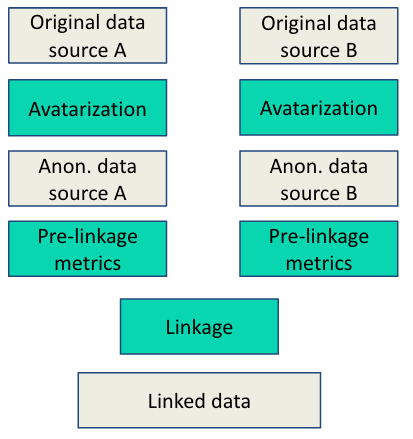

# Anonymization and privacy

This page describes how data can be anonymized with the avatar solution and what does it meant to link two anonymized datasets in terms of privacy.

## Anonymization with the avatar solution

Data linkage can be done in the context of original data but the project and the
library emerged from a need in a context of anonymized data where original data
cannot be shared for legal or competition reasons.

In this latter context, the typical pipeline would go as follows:

[Avatar](https://docs.octopize.io/) is an anonymization solution developed by Octopize that produces data respecting GDPR criteria in terms of addressing: singling-out, linkability, and inference. 

The solution is available on SaaS and on-Premise. Scripts demonstrating the full
pipeline make use of the SaaS version.

For more information, we recommend going through the [avatar public
documentation](https://docs.octopize.io/docs/quickstart) and reading the paper
describing the avatar method:

[Guillaudeux, M., Rousseau, O., Petot, J. et al. Patient-centric synthetic data generation, no reason to risk re-identification in biomedical data analysis. Nature Digital Medicine. 6, 37 (2023)](https://www.nature.com/articles/s41746-023-00771-5)

## Privacy

The avatar solution comes with privacy metrics and a privacy report can be
automatically generated. A dataset can only be considered anonymous if this is
confirmed by privacy metrics. The metrics covers the 3 GDPR criteria as
described in details
[here](https://docs.octopize.io/docs/understanding/Privacy#evaluation-criteria).

Privacy metrics confirm that it should not be possible to re-identify an individual in the data (singling-out), to link individual from the dataset with data from another source and to infer sensitive information from the data.

### Linkage and GDPR linkability criteria

While it may seem impossible to link data for which the linkability criteria is
respected, this is not the case as the GDPR linkability criteria prevents the
linkage of data from one individual to be linked with his data coming from a
different source. **The linkage as performed in this library is not impacted by
the respect of this criteria because linkage does not aim at recreating exactly
the original data but instead aims at associating individuals in a way to
preserve global statistics of a dataset (for example correlations).**

### Linkage and increased privacy

Through the experiments carried out, it has been observed that data linkage does
not add any privacy risk. The experiments where original data was split then
linked showed that applying avatar at each source yielded anonymized data at
each source and that their linkage resulted in data with some statistical
properties shared with the original data and **an increased level of
protection**. This can be explained by the fact that the linkage is approximate
and can be interpreted as an additional source of noise.

