# Experimental results

## Differences between the selected datasets

#### Dataset sizes
The number of rows in a dataset is a property which may be important when interpreting results because it probably has an impact on the linkage process. This is especially true because the proposed linkage solutions are approximative: the aim of the linkage process is not to link individual 1 from source A with individual 1 from source B but instead to link individual 1 from source A with another individual from source B in such way that the global statistical properties of the datasets are preserved.

We can expect that 
- linkage on a few individuals/records is less tolerant to approximation: for linkage of a given individual at source A, there are less candidate at source B than on datasets with a lot of individuals. 
- Also, a proper anonymization method (such as avatar) will modify to a greater extent individuals from a small dataset than from a large dataset (i.e. many individuals).
- **It is expected that linkage of larger datasets (in terms of number of individuals) should preserve better the global statistical properties.**

| Dataset    | Number of individuals |
| ---------- | --------------------- |
| student performance      | 395    |
| student dropout | 4424     |
| adult    | 10000 (out of 48842)    |
| pra    | 12430    |

#### Unicity scores

Based on the variables present in each datasets and in particular their cardinality, the unicity scores differ across datasets.The unicity score can be defined as a measure of how unique an individual or record is in a dataset.

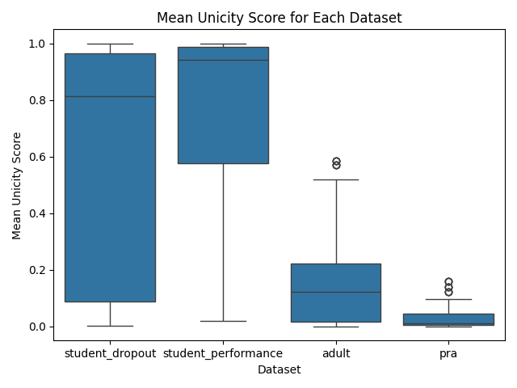

**Interpretation:**
- Unicity score can be very high on student_dropout and student_performance datasets. This is caused by the smaller size of these two datasets in comparison with the other datasets because it’s more likely that some individuals have unique traits not shared by others in a smaller dataset, resulting in a higher unicity score. Unicity score should be considered alongside number of records. 
- Because they are the datasets with the fewest individuals, the anonymization should also yield more differences to the original data (this should be seen on the assessment of the avatars linkage).

## Results with k=10

#### Graph 1: Correlation differences
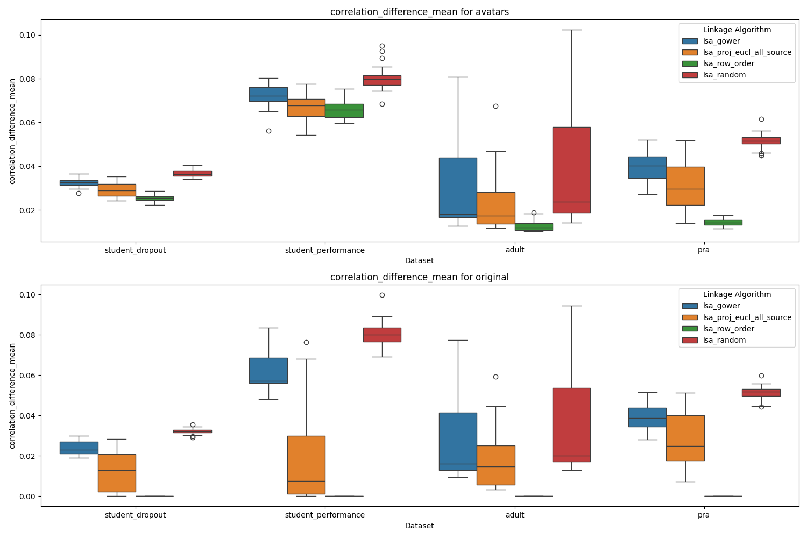

**Interpretation:**
- Graph 1 shows the performance of a set of linkage methods applied to link the two subsets of the original dataset (bottom panel) after splitting it and on the avatrized version of these two subsets (top panel).
- Across all datasets, *lsa + euclidean distance in a projected space* is the method giving the best results (i.e. correlation difference is the lowest, which means less distortion of the data’s structure before the linkage) and gives the most stable results.

#### Graph 2: Correlation differences (for high unicity scores only)
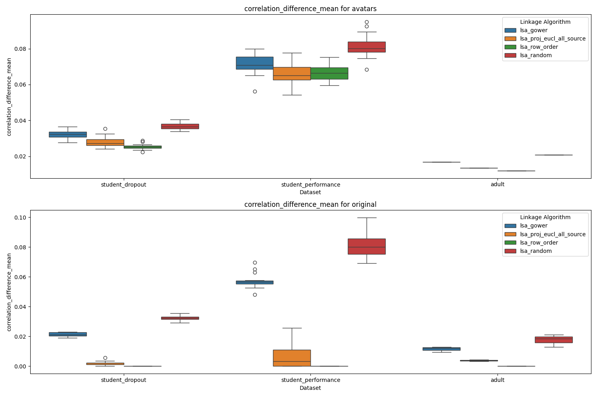

**Interpretation:**
- When the unicity score is high (e.g. > 0.5), the linkage with the best method is of similar or comparable quality to *row_order*, which matches datasets based on the original order of the rows. It can even outperform *row_order*.

#### Mean correlation differences for differerent level of unicity score

An acceptable level of correlation difference between original and sythetic linked data is difficult to define as it depends on the context and how the data will be used.

As a generic threshold, it is often considered that a difference lower than 0.1 is acceptable. For illustration purpose, we use 0.1 as a threshold when showing maximum correlation differences and we use 0.05 for mean correlation differences.

#### Graph 3: Mean correlation differencesv for avatars's differerent level of unicity score

**Interpretation:**
- Whether results are above or beyond the indicative acceptable threshold strongly depends on the dataset.
- Linked avatars yields acceptable mean correlation difference

#### #### Graph 4: Max Correlation differences for differerent level of unicity score
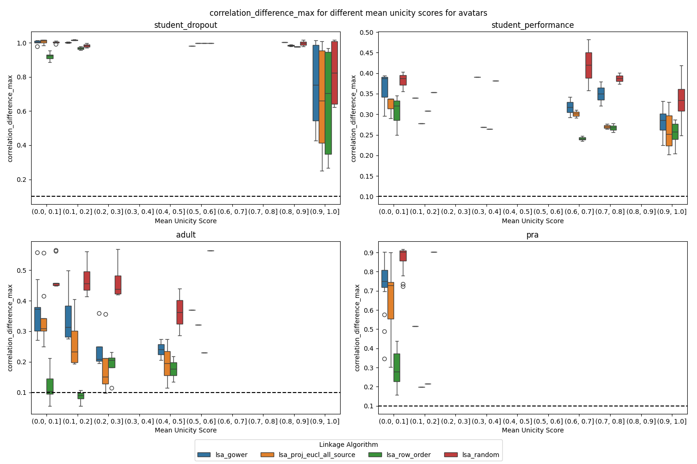

**Interpretation:**
- Maximum difference in correlation are not below the threshold and it is expected that some pairwise correlations will be altered.
- However, looking at one run of the best method on pra, we see that only a few correlations are displaying large differences. We also observe that this correlation difference is high with the reference *row_order* linkage. @olivierabz does not the row_order have the lowest median correlation difference here? I am not sure a bit lost 

- We observe that a global correlation may not be kept at linkage but we also see that no non-existent correlation is created. This is important wrt. the contexts in which such linked data can be used. (@olivierabz, I think here we mean the graph below? this has to be addressed, no?)
- The likely reason behind this is that with some data splits, a variable globally correlated with another becomes completely uncorrelated and independent in its own split. Anonymization of the split alters this variable independently and global correlation is lost. There is no way such correlation can be restored at linkage. Note that this does not happen when a variable is globally correlated with several other variables because such variables would not become independent when the data is split.
- Changing anonymization parameters does not help (not shown here but similar results in terms of maximum correlation differences are obtained when using k=3 instead of k=10 in avatar)

#### Graph 5
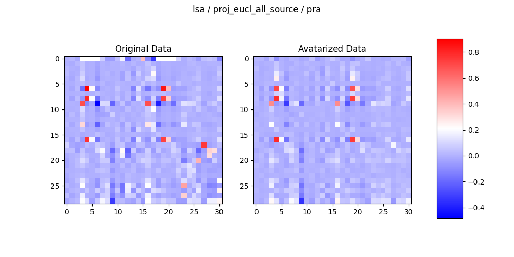
#### Graph 6
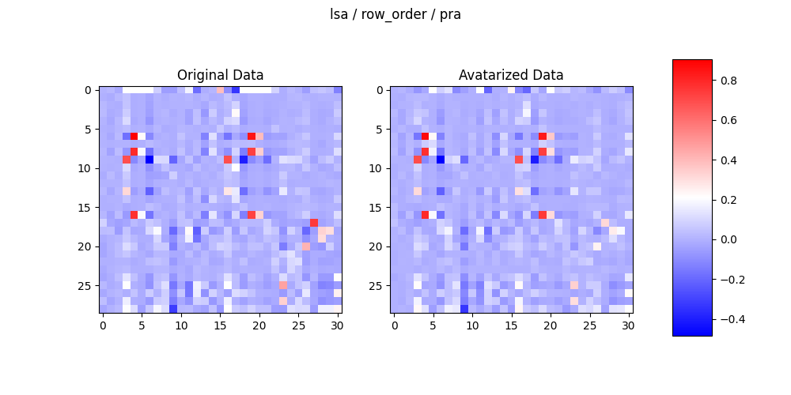
#### Graph 7
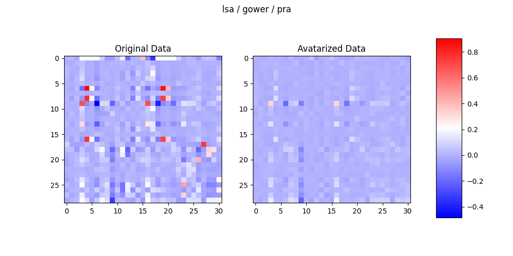
#### Graph 8
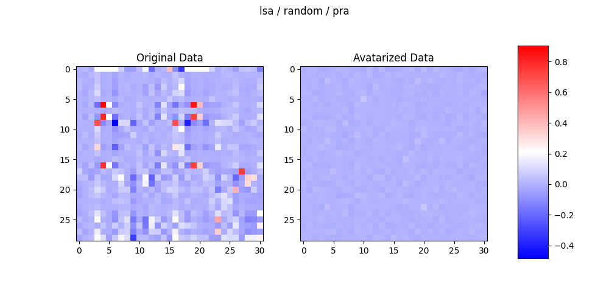

## Can we predict post-linkage results from pre-linkage metrics ?

#### Graph 9: Correlation between Unicity score (pre-metric) and correlation difference (post-metric)
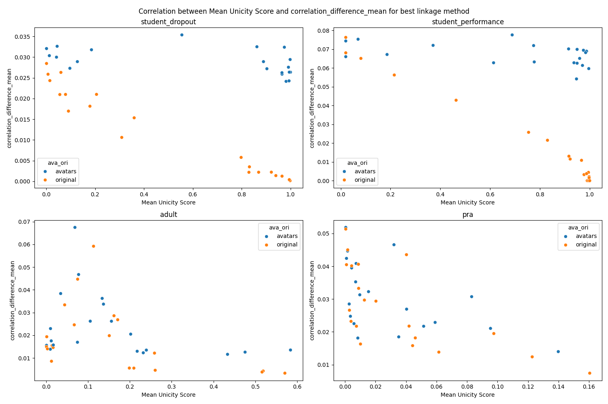

**Interpretation:**
- The trend (correlation) between pre and post linkage metrics is clear when linking subsets of the original data
- The correlation can be observed on avatar linkage on adult and pra.

#### #### Graph 10: Correlation between Contribution score (pre-metric) and correlation difference (post-metric)
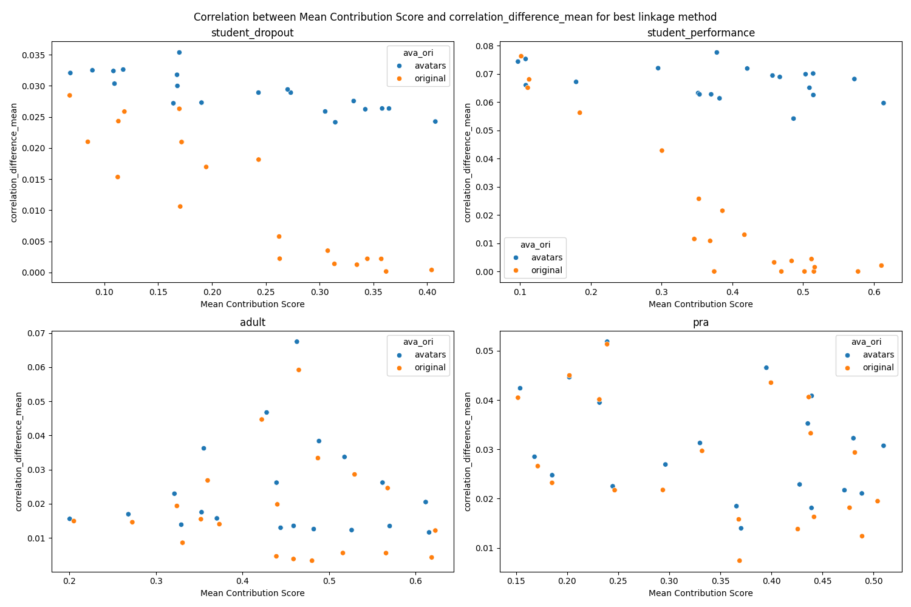

**Interpretation:**
- No systematic clear correlation with post-linkage metric when using this contribution score. Focusing on pra and adult where a correlation is observed on unicity score, we see that this is not the case here. @olivierabz not very clear to me here

#### Impact of dataset size on linkage of avatars

To study the impact of the number of records, we use the two largest datasets and sample them (with seeds) to obtain datasets of respective size 10000, 5000, 1000 and 500 on which avatarization and linkage by means of *lsa + euclidean distance in a projected space*.

#### Graph 11
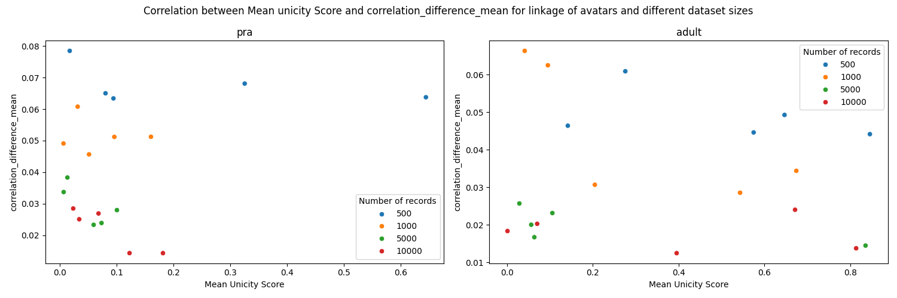
#### Graph 12
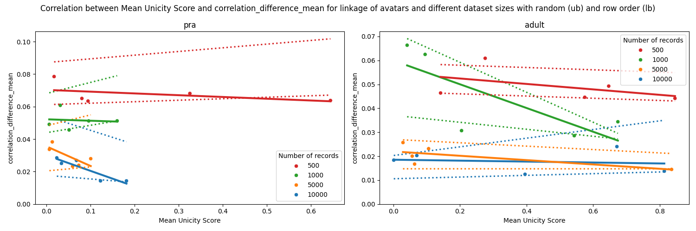

**Interpretation:**
- The more records, the closer to original. This is an expected findings: more individuals in a dataset means that there are more potential good candidates for association during the linkage step.

## Take-home messages

- Unicity score should be combined with number of records to decide whether linkage could be performed.
- Mean correlation difference is a post-linkage that can be used.
- When having sufficient number of records (i.e. > 5000), unicity score is correlated to post-linkage metric and so should be maximised. 
- Some global correlations may not be "preserved" but non-existent correlations will not be created at linkage
    - :point_right: **Correlation in linked data can be considered as real correlations.**
    - :point_right: **But a lack of correlation in linked data may not necessarily mean that there is no correlation.**
- Based on 2 datasets large enough in this study, we suggest that unicity score should be greater than ~0.2 before attempting linkage. Additional runs on more datasets should be executed to determine a threshold.
- This library should serve as a basis to assess additional options to measure and perform linkage of synthetic data. Additional distances, algorithms and metrics can easily be added to it and evaluated.