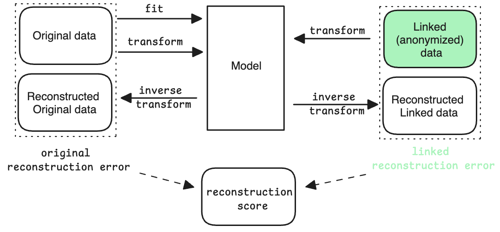

# Post-linkage metrics

Because post-linkage metrics rely on accessing the original un-split data, they are only suitable to specific contexts:
- experimental context where the data is purposely split under different scenarios to study the performance of linkage solutions or to develop new ones. This is the context in which results presented in [*Experiments*](./experiments.md) where generated.
- Development/configuration phase for a real-life use case. Prior to deploying a functionality using linkage in production, it may be possible to assess its future performance on samples or on synthetic data. In this context, data with primary key (or identifiers) can be shared and the un-split data (i.e. ground truth) reconstituted and compared with the linked data. 

We present here two generic metrics.

## Correlation retention

The main objective of data linkage is to preserve or reconstitute relationship between variables that are in different datasets or sources. Naturally, pairwise correlations can be calculated on the linked data and compared to those of original data. For this purpose, we use Pearson correlations coefficients whose absolute value represent how strong a correlation is between two variables.

Correlation retention is the absolute difference between correlations of original and linked data for each pair of variables in $A$ and $B$ respectively.  Several statistics can then be used to measure success of linkage: *mean correlation retention*, *max correlation retention*, *sum of correlation retention*. 

Correlation retention can also be plotted. Below are two examples of good (using a *row order* linkage) and poor (using a *random* linkage) correlation retention.

## Reconstruction score

Correlation retention focuses on pair-wise correlation and so is a bi-variate metric. However, a dataset can have more complex relationships between more than 2 variables. The reconstruction score relies on a factorial analysis model (e.g. PCA) in order to capture all relationships that may exist in the data and this without limitations in term of number of variables in those relationships.

The reconstruction score is the difference between the reconstruction error of the original data and the reconstruction error of the linked data.
Reconstruction error is computed by first fitting a model on the original data and by keeping the first dimensions (the ones explaining most variance). This model represents the original data. By projecting any data on this model and reconstructing the data (i.e. inverse transform), we can compute the reconstruction error. 

If the data has similar statistical properties to the original data, the reconstruction error will be close to the reconstruction error of the original data. On the other hand, if the data has different statistical properties, the reconstruction error will be higher. Measuring this difference is a way to capture how globally similar the linked data is to the original data. This metric is multivariate since each model dimension potentially combines information from all variables.

Because reconstructed data needs to be in the original space, it may be a mix of numeric and categorical types, so the reconstruction error is measured by means of the Gower distance.

